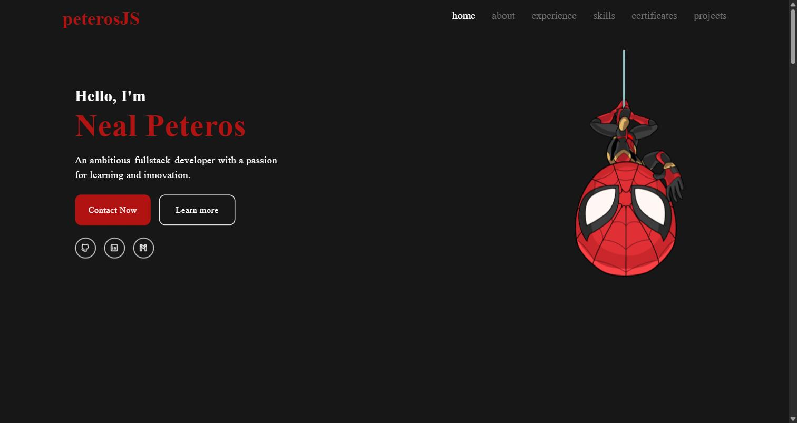

# peterosJS — Personal Portfolio

Personal portfolio site for Neal Andrew B. Peteros, a full-stack web developer from Cebu, Philippines. It's a single-page, scroll-navigated site covering Home, About, Work Experience, Skills, Certificates, Projects, and Contact.

**Live site:** https://peterosjs.vercel.app/



## Features

- **Home** — intro, animated rotating role (`frontend`/`backend`/`fullstack`/`mobile`), social links, and CTAs.
- **About** — bio and resume download.
- **Experience** — timeline of past roles.
- **Skills** — tech stack grid with hover effects.
- **Certificates** — carousel of earned certificates.
- **Projects** — cards with description, live link, and GitHub link for each project.
- **Contact** — a name/email/message form with client-side validation and an inline success confirmation on submit.
- Smooth section-to-section navigation with active-link highlighting as you scroll.
- Scroll-triggered fade-in animations (`scrollreveal`) and hover/motion effects (`framer-motion`).
- Fully responsive layout (mobile, tablet, desktop).

## Technologies Used

- [React 19](https://react.dev/) + [TypeScript](https://www.typescriptlang.org/)
- [Vite](https://vite.dev/) — build tooling
- [Tailwind CSS](https://tailwindcss.com/) — styling
- [Framer Motion](https://www.framer.com/motion/) — animations
- [ScrollReveal](https://scrollrevealjs.org/) — scroll-triggered reveals
- [Flowbite React](https://flowbite-react.com/) — carousel component
- [Radix UI](https://www.radix-ui.com/) — accessible accordion primitive
- [React Router](https://reactrouter.com/) — routing/links
- [Lucide React](https://lucide.dev/) — icons
- Deployed on [Vercel](https://vercel.com/)

## Setup

```bash
npm install      # install dependencies
npm run dev      # start local dev server
npm run build    # type-check and build for production
npm run preview  # preview the production build locally
```
